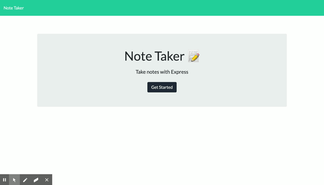

# Note-Taker

## Description

This application can be used to write, save, and delete notes. This application will use an express backend and save and retrieve note data from a JSON file.

## Table of Contents

- [Description](#Description)
- [Installation](#Unstallation)
- [Contribute](#contribute)
- [License](#License)
- [Questions](#questions)

## Description

This application can be used to write, save, and delete notes. This application will use an express backend and save and retrieve note data from a JSON file.

[App Link]()

## Visualization of App Interface

## Installation

1. Clone the repository 2. run `npm install` in terminal

## Contribute

Please submit [bugs and feature requests](https://github.com/nrouhanizdeh/Task-Tracker/issues)

## License

MIT

## Questions

For more information, please visit [https://github.com/nrouhanizadeh](https://github.com/nrouhanizadeh).
You can also contact us at [negin.rouhanizadeh@gmail.com](mailto:negin.rouhanizadeh@gmail.com) with any additional questions or comments.

To deploy an application with a MongoDB database to Heroku, you'll need to set up a MongoDB Atlas account and connect a database from there to your application. Be sure to use the following guides for support:

- [Set Up MongoDB Atlas](../04-Important/MongoAtlas-Setup.md)

- [Deploy with Heroku and MongoDB Atlas](../04-Important/MongoAtlas-Deploy.md)
